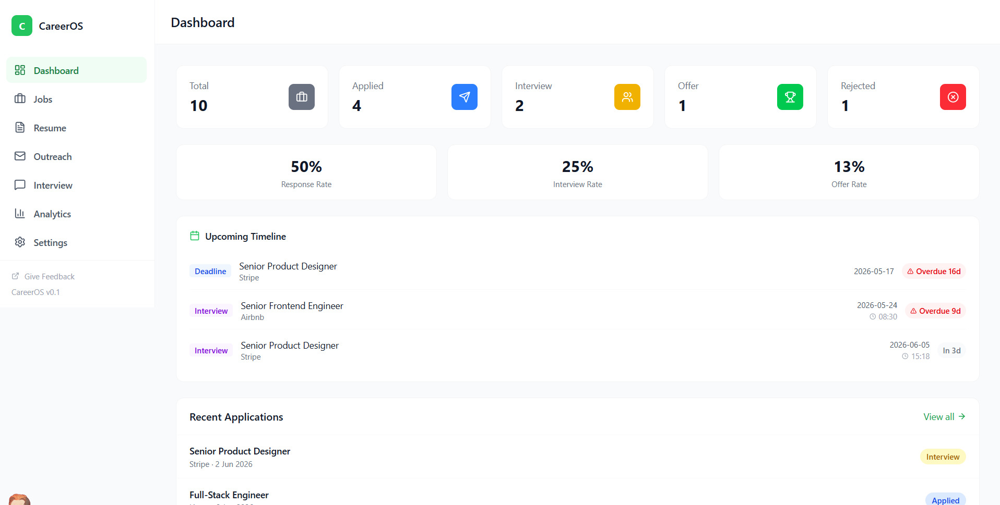
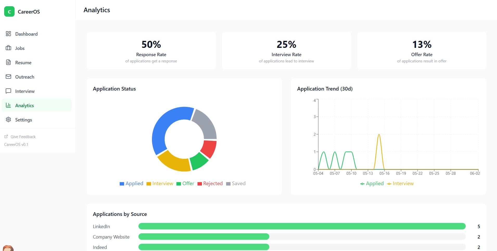
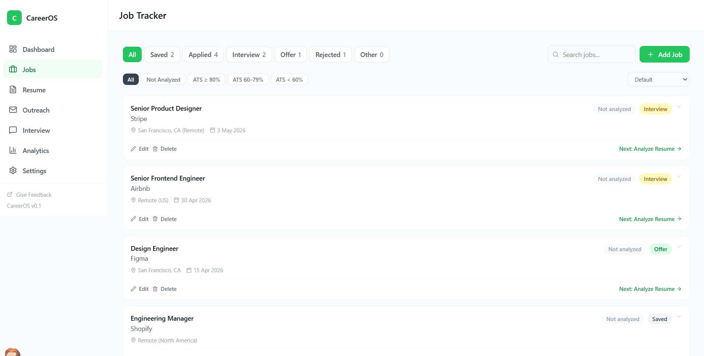

# CareerOS — AI-powered Job Search Manager

> An AI-assisted web app that helps first-time job seekers know **what to do, where they stand, and how far they've come** in a job search.
>
> 一个 AI 辅助开发的求职管理网页，帮"求职新手"理清**该做什么、做到哪一步、还差多少**。

🔗 **[Live Demo](https://careeroperatingsystem.vercel.app/)**  ·  📊 Built solo · deployed on Vercel  ·  🌐 **[English](#english)** | **[中文](#中文)**

<!-- 提示：把本仓库根目录新建一个 screenshots 文件夹，并放入 dashboard.png / analytics.png / jobs.png 三张图（我已按这些文件名给你导出），下面的图片就能正常显示。视频录好后，把 ⬇️ 那个链接占位替换掉即可。 -->



---

## English

### Overview

When you're job hunting at scale for the first time, your applications end up scattered across different platforms, follow-up and interview dates slip through the cracks, and you lose sight of your overall progress and conversion rates. It's easy to fall into a familiar anxiety: *"I've applied to so many places, but I have no idea where I actually stand, or whether I'm moving forward."*

CareerOS is my answer to that. I started from a single local HTML page, taught myself to deploy it, and have been using it as a real user throughout my own job search.

> **Status:** v0.1 — an early-stage personal project, actively used and iterated.

### Features

- **Dashboard** — at-a-glance counts (saved / applied / interview / offer / rejected), response rate, interview rate, and offer rate, plus upcoming follow-ups and interviews with overdue / due-soon reminders.
- **Job Tracker** — track every role through a status pipeline (Saved → Applied → Interview → Offer → Rejected), with search, quick add, sorting, and an ATS-score filter. Each job card surfaces a **"Next step"** action so you always know what to do next.
- **Analytics** — a visual panel with an application-status donut chart, a 30-day application trend line, an applications-by-source breakdown, and the key conversion rates. (This turned out to be the part that gave me the most peace of mind.)
- **Guided workflow** — enter a job and CareerOS walks you through the whole pipeline end to end: analyze résumé → tailor résumé → apply → follow up → interview (with a text-based mock) → post-interview follow-up.
- **Résumé library & ATS matching** — save multiple résumés and reuse them per job (no re-uploading each time). ATS analysis extracts keywords with AI first, then matches them against the job description; edits are highlighted in green so you can see exactly what changed.
- **Outreach & interview tools** — draft outreach / follow-up emails and run a text-based mock interview.
- **Settings** — language switching with consistent multilingual output, plus local data backup/export (the app runs without any login or cloud account).
- **Feedback** — an embedded Google Form so real users can send feedback directly to me.

### How I Built It (0 → 1)

I'm not a software engineer by training — I'm a pharmacy / Traditional Chinese Medicine background researcher. I built CareerOS by **directing Claude Code (AI pair-programming) inside VS Code**, and the interesting part was never "getting the AI to generate code." It was deciding *what* to build, judging whether the output was right, and figuring out how to get unstuck. A few moments I'm proud of:

- **Shipping it for real.** It began as a local page; I registered for GitHub and Vercel, wired up continuous deployment, and got to the point where a fix I push updates the live site worldwide almost instantly.
- **A scrappy fix for web scraping.** Importing jobs by URL normally needs an extra paid component or plugin — too much for a beginner to set up. Instead, I found a clever prompt that got Claude Code to write the scraping code itself, keeping the feature accessible.
- **Lots of small UX calls.** Merging the follow-up and interview reminder panels; adding per-job "next step" actions and page routing; separating Edit vs. Detail views; building the résumé library so each job doesn't need its own re-upload; stabilizing the ATS flow (AI keyword extraction → JD match); green-highlighting résumé diffs; keeping generated output consistent with the language setting; and adding local data backup.

### What I Learned (and What I Cut)

After using CareerOS myself for two weeks, I did the thing I think matters more than any single feature — I looked honestly at what I *actually* used:

- **What earned its place:** application tracking, follow-up & interview reminders, and the analytics dashboard. These directly solved the real problem — the anxiety of not knowing where I stood.
- **What I'm cutting:** résumé analysis, the interview mock, and email drafting. In practice I reached for general-purpose AI tools instead, because conversational, highly personalized tasks are better served there — and I don't think it's worth rebuilding what already exists well.
- **The biggest unmet need:** a single, cross-platform view. Job platforms rarely expose clean data exports (they want to keep users in-app), which is exactly why scraping is hard — and exactly why this problem is worth solving. If a platform or company site offered a downloadable JSON of a posting, it could be imported straight into CareerOS.

I think knowing what to *remove* — and why — says more than a long feature list.

### Tech Stack

- **Development:** built primarily with **Claude Code (AI-assisted development)** in VS Code
- **Deployment:** **GitHub + Vercel** continuous deployment (push to deploy)
- **AI:** integrated LLM for keyword extraction and résumé–JD matching
- **Feedback:** embedded Google Form
- **Data:** client-side, with local backup/export (no login / no cloud backend)
- **Frontend:** Next.js, React, TypeScript, Tailwind CSS <!-- 待补充：例如 React / 原生 HTML+JS；图表库如 Chart.js / Recharts — 按你实际用的填 -->

### Screenshots

| Dashboard | Analytics | Job Tracker |
|---|---|---|
|  |  |  |

🎥 **Demo video:** <!-- 待补充：录好后把视频链接贴在这里，例如 YouTube / Bilibili 链接 -->

### Running Locally

```bash
git clone https://github.com/Alia2035/CareerOS.git
```
<!-- 待补充：根据你的实际项目填运行方式。
     - 若是纯静态 HTML：直接用浏览器打开 index.html，或用 VS Code 的 Live Server。
     - 若是 Node 项目：npm install 然后 npm run dev（具体以 package.json 为准）。
     把不适用的那种删掉即可。 -->

### Feedback

Found a bug or have an idea? Use the **Give Feedback** link inside the app — it goes straight to me.

---

## 中文

### 项目简介

第一次大规模找工作时，岗位散落在各个招聘平台，follow-up 和面试时间很容易漏掉，也看不到整体进度和转化率，很容易陷入一种熟悉的焦虑：*"投了很多，却不知道自己到底在哪、是不是在往前走。"*

CareerOS 就是我对这个问题的回答。它从一个本地 HTML 页面起步，我自己学着把它部署上线，并在整个求职过程中作为真实用户一直在用。

> **状态：** v0.1 —— 早期个人项目，持续使用与迭代中。

### 核心功能

- **仪表盘**：一眼看全各状态数量（已保存 / 已投递 / 面试 / 录取 / 已拒），以及回复率、面试率、录取率；同时汇总即将到来的 follow-up 与面试，并标注"已逾期 / 还剩几天"提醒。
- **岗位追踪（Job Tracker）**：按状态流水线管理每个岗位（已保存 → 已投递 → 面试 → 录取 → 已拒），支持搜索、快速添加、排序，以及按 ATS 匹配分筛选。每条岗位卡片都会给出**"下一步"**操作，让你随时知道接下来该做什么。
- **数据分析**：可视化面板，包含申请状态饼图、近 30 天投递趋势折线图、岗位来源分布，以及核心转化率。（事实证明，这部分给了我最大的心理安定感。）
- **全流程引导**：录入一个岗位后，CareerOS 会带你走完一条龙：分析简历 → 修改简历 → 投递 → follow-up → 面试（含文字版 mock）→ 面试后跟进。
- **简历库 & ATS 匹配**：可保存多份简历并按岗位复用（不必每次重新上传）。ATS 分析先用 AI 提取关键词，再与 JD 比对；简历修改处用绿色高亮，改了哪儿一目了然。
- **外联与面试工具**：生成外联 / follow-up 邮件，并提供文字版模拟面试。
- **设置**：语言切换，且生成内容与语言设置保持一致；另有本地数据备份 / 导出（应用无需登录、不依赖云端账号）。
- **反馈入口**：内嵌 Google Form，真实用户可直接把反馈发给我。

### 从 0 到 1 怎么做的

我不是科班出身的软件工程师——我的背景是药学 / 中药学研究。CareerOS 是我**在 VS Code 里指挥 Claude Code（AI 结对编程）**做出来的，而真正难的从来不是"让 AI 生成代码"，而是决定*要做什么*、判断生成的对不对、卡住了怎么绕。几个我挺有成就感的点：

- **真的把它上线了。** 最初只是个本地页面；我注册了 GitHub 和 Vercel，接通自动部署，做到改完一推、全网几乎即时更新。
- **一个取巧但管用的抓取方案。** 按 URL 导入岗位通常要装额外的付费组件或插件——对新手太难了。于是我找到一个巧妙的指令，让 Claude Code 自己写出抓取代码，把这个功能的门槛降了下来。
- **大量打磨使用体验的小决定。** 把 follow-up 与面试提醒面板合并；给每个岗位加"下一步"操作和页面跳转；区分"编辑"与"详情"；建简历库让每个岗位不必重复添加简历；把 ATS 流程稳定下来（AI 提关键词 → 与 JD 匹配）；简历改动处绿色高亮；让生成内容与语言设置保持一致；以及加入本地数据备份。

### 反思与迭代（我砍掉了什么，为什么）

自己用了两周后，我做了一件我认为比"多加一个功能"更重要的事——诚实地看清自己*真正*在用什么：

- **真正留下来的：** 求职进度追踪、follow-up 与面试提醒、数据分析面板。它们直接解决了那个真问题——"不知道自己在哪"的焦虑。
- **我决定砍掉的：** 简历分析、面试 mock、邮件生成。实际使用中我反而更愿意用通用 AI 工具，因为这类需要对话、需要高度个性化的任务，它们做得更好——我也不认为有必要去重复造一个已经很好用的轮子。
- **最大的未满足需求：** 一个跨平台的统一视图。各招聘平台为了把用户留在站内，通常不开放干净的数据导出——这正是抓取很难的原因，也正是这个问题值得做的原因。如果某个平台或公司官网能提供岗位的 JSON 下载，就能直接导入 CareerOS。

我觉得，知道该*删掉*什么、以及为什么，比一长串功能清单更能说明问题。

### 技术栈

- **开发：** 主要在 VS Code 中用 **Claude Code（AI 辅助开发）**完成
- **部署：** **GitHub + Vercel** 持续部署（推送即上线）
- **AI：** DeepSeek API, OpenAI API, 用于关键词提取与简历–JD 匹配
- **反馈：** 内嵌 Google Form
- **数据：** 纯客户端，支持本地备份 / 导出（无登录、无云端后端）
- **前端：** Next.js, React, TypeScript, Tailwind CSS <!-- 待补充：例如 React / 原生 HTML+JS；图表库如 Chart.js / Recharts —— 按你实际用的填 -->

### 截图

| 仪表盘 | 数据分析 | 岗位追踪 |
|---|---|---|
|  |  |  |

🎥 **演示视频：** <!-- 待补充：录好后把链接贴在这里，例如 B 站 / YouTube 链接 -->

### 本地运行

```bash
git clone https://github.com/Alia2035/CareerOS.git
```
<!-- 待补充：按你的实际项目填运行方式。
     - 纯静态 HTML：直接浏览器打开 index.html，或用 VS Code 的 Live Server。
     - Node 项目：npm install 后 npm run dev（以 package.json 为准）。
     删掉不适用的那种即可。 -->

### 反馈

发现 bug 或有想法？用应用内的 **Give Feedback** 链接——会直接发到我这里。

---

<sub>Built by directing AI, with a lot of human judgment in between. · 在 AI 与大量人为判断之间做出来的。</sub>
